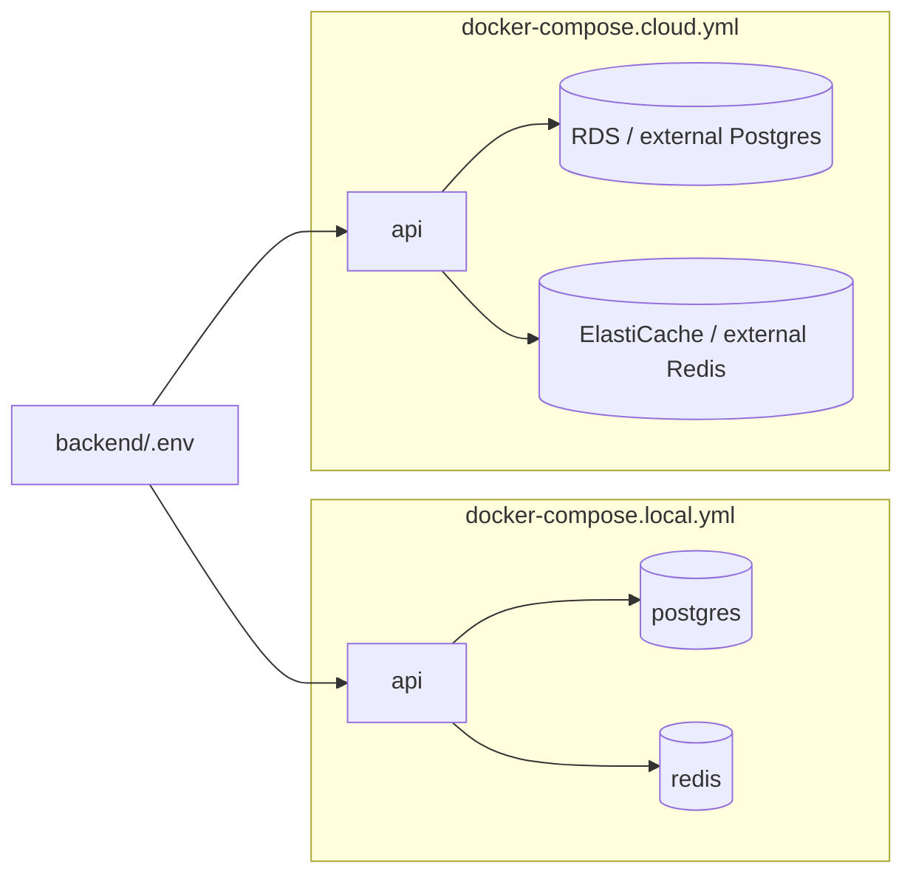

# Docker — Pimienta Backend

Container images and Compose stacks for the Spring Boot API. All Docker assets live under `docker/`; the **Maven project root** (`backend/`) remains the image **build context** (see [Why `.dockerignore` stays at the project root](#why-dockerignore-stays-at-the-project-root)).

## Layout

| File | Purpose |
|------|---------|
| `Dockerfile` | Multi-stage build (Maven → JRE 25 Alpine) — cloud / production |
| `Dockerfile.dev` | Maven dev image with bind-mount hot reload |
| `dev-entrypoint.sh` | Watches `src/`, runs `mvn compile` + `spring-boot:run` |
| `docker-compose.local.yml` | API + PostgreSQL 16 + Redis 7 on a private Compose network |
| `docker-compose.cloud.yml` | API only; connects to managed Postgres and Redis via `.env` |

## Prerequisites

- Docker Engine 24+ and Docker Compose v2
- Copy `backend/.env.example` → `backend/.env` and set secrets (JWT, AWS, and for cloud mode DB/Redis endpoints)

Run every command from the **`backend/`** directory (project root), not from `docker/`.

## Local stack (Postgres + Redis + API)

Use this for full local development inside Docker. Database and cache **hostnames are fixed in the compose file** (`postgres`, `redis`) so the API always talks to the sibling containers on the default Compose network.

| Service | In-container | On your machine (host) |
|---------|----------------|-------------------------|
| API | `http://api:8080` | http://localhost:8080 (or `API_PORT`) |
| PostgreSQL | `postgres:5432` | `localhost:5431` |
| Redis | `redis:6379` | `localhost:6378` |

Default DB credentials (also hardcoded for the API service): database `pimienta_alimentos`, user/password `pimienta_dba`. Flyway uses schema `pimienta` (see `application.yaml`).

```bash
cd backend

# First time: create .env (JWT, AWS, optional API_PORT)
cp .env.example .env

docker compose -f docker/docker-compose.local.yml up --build
```

### Hot reload (local API)

The `api` service uses **`Dockerfile.dev`** with:

- **Bind mount** `backend/` → `/workspace` so you edit files on the host.
- **Anonymous volumes** for `/workspace/target` and `/root/.m2` so compiled classes and dependencies stay inside Docker (avoids slow sync and host/container `target` conflicts).

On save under `src/main/java`, `src/main/resources`, or `pom.xml`, the entrypoint runs `mvn compile`; **spring-boot-devtools** restarts the app when `target/classes` changes. First startup can take a few minutes while Maven downloads dependencies into the `.m2` volume.

```bash
# Foreground (recommended while developing — see compile/restart logs)
docker compose -f docker/docker-compose.local.yml up api

# Or detached
docker compose -f docker/docker-compose.local.yml up -d api
docker compose -f docker/docker-compose.local.yml logs -f api
```

Rebuild the dev image only when `Dockerfile.dev`, `dev-entrypoint.sh`, or `pom.xml` dependencies change:

```bash
docker compose -f docker/docker-compose.local.yml up -d --build api
```

Useful commands:

```bash
# Logs
docker compose -f docker/docker-compose.local.yml logs -f api

# Manual compile inside the running container (optional)
docker compose -f docker/docker-compose.local.yml exec api mvn -q compile -DskipTests

# Stop and remove containers (keeps volumes)
docker compose -f docker/docker-compose.local.yml down

# Stop and remove volumes (wipes local DB/Redis data)
docker compose -f docker/docker-compose.local.yml down -v
```

## Cloud / staging stack (API only)

Use this when PostgreSQL and Redis are **already running elsewhere** (e.g. AWS RDS and ElastiCache). Only the API container is started; connection strings come from `backend/.env`.

Required variables in `.env` (see `.env.example`):

- `POSTGRES_URL` — JDBC URL, e.g. `jdbc:postgresql://your-rds-host:5432/pimienta_alimentos`
- `POSTGRES_USER`, `POSTGRES_PASSWORD`
- `REDIS_HOST` — hostname or IP reachable from the container
- `REDIS_PORT` — optional, default `6379`
- `PIMIENTA_SECURITY_JWT_SECRET`, AWS variables as needed

```bash
cd backend
cp .env.example .env
# Edit .env with RDS/ElastiCache endpoints and secrets

docker compose -f docker/docker-compose.cloud.yml up -d --build
```

Ensure the host in `POSTGRES_URL` and `REDIS_HOST` is reachable from inside the container (public RDS endpoint, VPN, or `host.docker.internal` for services on the Docker host).

## How configuration flows



1. **Compose** substitutes `${VAR}` from `backend/.env` when you run commands from `backend/`.
2. **`env_file: ../.env`** passes variables into the container process.
3. **`environment:`** in the compose file sets Spring properties (`SPRING_DATASOURCE_*`, `SPRING_DATA_REDIS_*`). Local compose **overrides** these with fixed in-network hosts; cloud compose maps them from `.env`.
4. The container runs with **`SPRING_PROFILES_ACTIVE=docker`**, loading `application-docker.yaml`, which reads the `SPRING_*` variables above.

The app does **not** read `.env` from disk inside the container; only OS environment variables matter at runtime.

## Building the image without Compose

```bash
cd backend
docker build -f docker/Dockerfile -t pimienta-api:local .
```

## Why `.dockerignore` stays at the project root

Docker only reads `.dockerignore` from the **build context root**. Because the context is `backend/` (parent of `docker/`), `.dockerignore` must remain at `backend/.dockerignore`, not inside `docker/`.

## Troubleshooting

| Symptom | Check |
|---------|--------|
| API exits on startup (DB) | Local: `docker compose -f docker/docker-compose.local.yml ps` — wait for `postgres` healthy. Cloud: `POSTGRES_URL` reachable from container. |
| Redis connection errors | Local: service name must stay `redis`. Cloud: `REDIS_HOST` / security groups / TLS if applicable. |
| Port already in use | Change `API_PORT` in `.env` or stop the process using 8080 / 5431 / 6378. |
| Flyway / schema errors | RDS and local DB need schema `pimienta`; migrations run on startup via Flyway. |

## Related docs

- [../README.md](../README.md) — project overview and non-Docker local run (`./mvnw spring-boot:run`)
- [../src/main/resources/application-docker.yaml](../src/main/resources/application-docker.yaml) — `docker` Spring profile
